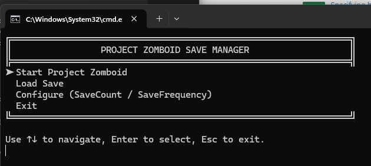
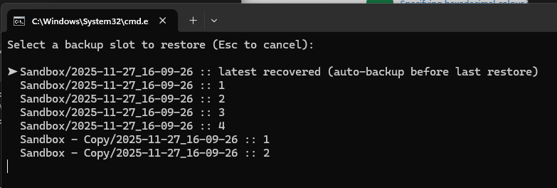

# SaveMyZomboid – Save Manager & Auto-Backup Tool

This tool adds a **save/load system** to Project Zomboid singleplayer.  
It allows you to rotate multiple save slots, recover saves, restore old versions, and automatically back up (save) your world while playing.
# !!! BACKUP YOUR SAVE FILES BEFORE USING THIS TOOL !!!

---





## What the Tool Does

- Creates rotating backup slots  
- Can restore any slot back into the active save  
- Protects your current save by storing it in **"latest recovered"** before overwriting  
- Only backs up when important files actually changed  
- Uses fingerprinting to avoid unnecessary disk writes  
- Fully supports heavy PZ save folders  
- Performs delta copies, so it only saves files that has changed
- Lets you modify configuration directly from the menu

---

## Requirements

- PowerShell 5.1 (built into Windows) 
- A standard Project Zomboid install  
- Steam is optional but required to launch the game from the script.
  - If you launch it without steam then you need to manually update the script, line 345, ``Start-Process $Script:SteamURI`` with your own config.

---

## Folder Structure

Make a folder anywhere you want, for example:
```
C:\SaveMyZomboid
├── SaveMyZomboid.ps1
├── Start-SaveMyZomboid.bat
└── README.md
```

The script automatically uses:
``%USERPROFILE%\Zomboid\Saves\ (game saves)``
``%USERPROFILE%\Zomboid\Backup\ (backup slots)``

You do NOT need to configure paths manually.

## ▶How to Run

### **Method 1 – Double-Click**
Double-click: ``Start-SaveMyZomboid.bat``

This launches PowerShell with execution bypass enabled.

### **Method 2 – Right-Click → Run with PowerShell**
If the `.bat` isn’t used.

---

## Using the Menu

When the script starts, you see a menu like:

Menu navigation is via:

- **Arrow keys** ↑ ↓  
- **Enter** to select  
- **Esc** to quit menus  
- **Numbers** may also work depending on the action

---

## When the Game is Running

If Project Zomboid is currently active:

- The menu shows: ``ProjectZomboid process running...``
- Loading saves is disabled  
- Config changes are disabled  
- Auto-backup mode is active  
- When the game closes, menu returns to normal

---

## Loading a Save Slot

When you choose *Load Save Slot*:

1. Your **current active save** is backed up to: ``latest recovered``
2. The selected slot is restored to the active save folder.
3. You can immediately start the game or return to menu.

The “latest recovered” slot appears in the list with a description.

---

## Changing Configuration

The menu allows live updates to:

- **Save slot count** (e.g. 5 rotating slots)
- **Save frequency** (in minutes)
- (optionally more settings depending on script version)

Values take effect immediately.

---

## Automatic Backups

While the game is running, the script:

1. Monitors important save files:
- `map.bin`
- `statistic.bin`
- `players.db`
- `vehicles.db`
2. Detects changes using hashes/timestamps  
3. If changes occur:
- Saves to next rotating slot  
- Uses multi-threaded Robocopy for speed  

This happens on the configured interval (e.g. every 30 minutes).

---

## Troubleshooting

### Script closes instantly
Run via the `.bat` file.  
You can also open a PowerShell window manually and run: ``powershell -ExecutionPolicy Bypass -File .\SaveMyZomboid.ps1``

### “Backup folder missing”
The script automatically creates it.

### “Game won’t start”
Ensure Steam is installed and the game is owned.  
The script uses: ``steam://rungameid/108600``


---

## Uninstalling
Just delete the folder containing:

- `SaveMyZomboid.ps1`
- `Start-SaveMyZomboid.bat`

Your game saves and backups remain in: ``%USERPROFILE%\Zomboid\``


Delete them manually if desired.

---

Enjoy, survivor.
